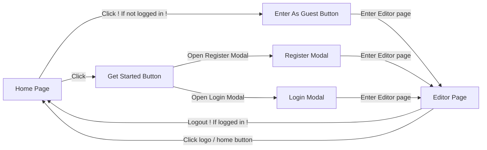

## Application Lifecycle ##

```mermaid
graph LR
A[Home Page] -- Click --> Z[Get Started Button]
A[Home Page] -- Click ! If not logged in ! --> X[Enter As Guest Button]
X[Enter As Guest Button] -- Enter Editor page--> D[Editor Page]
Z[Get Started Button] -- Open Login Modal --> B[Login Modal]
Z[Get Started Button] -- Open Register Modal --> C[Register Modal]
C[Register Modal] -- Enter Editor page  --> D[Editor Page]
B[Login Modal] -- Enter Editor page  --> D[Editor Page]
D[Editor Page] -- Logout ! If logged in ! --> A[Home Page]
D[Editor Page] -- Click logo / home button --> A[Home Page]
```